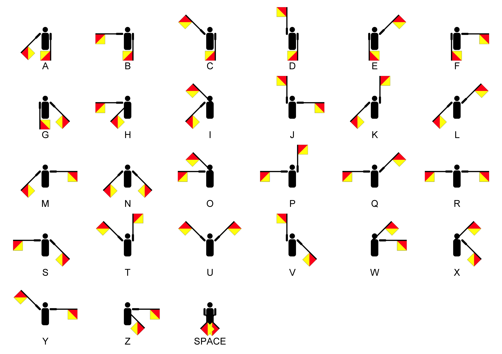
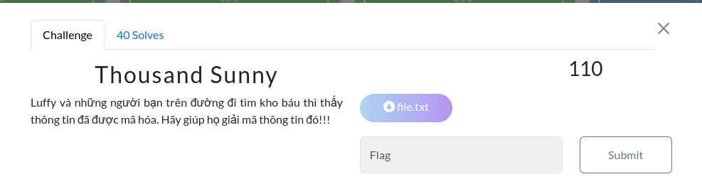

# **MiniCTF2024 Write-up**
-   Time: _September 4, 2024_
-   Place: _Online_
-   Website: _<https://minictf.infosecptit.club/>_
-   Author: _Bui Quoc Lap D24AT161 (l4pp)_


## **Category : Welcome**


### **Challenge : Welcome**
_(100 pt, 50 solves, flag : miniCTF{ar3_u_re4dy???})_


#### **_Solution_** 

Follow the instruction. Go to Discord -> Join Server -> #Reward -> get the flag 


#### _**Comment**_ 

## **Category : Warm up**

### **Challenge : Base32**
_(100 pt, 68 solves, flag : miniCTF{Th1s_1s_just_b3g1nn1ng})_


#### _**Solution**_

Look at challenge name and the text, may be use Base32 decode will help. So I go to *[Cryptii](https://cryptii.com/pipes/base32)* to decode message and get the flag  : 


#### _**Comment**_ 

### **Challenge : Flag in text** 
_(100 pt, 63 solves, flag : miniCTF{y0u_f0und_th3_s3cr3t})_


#### _**Solution**_
Open the given file and try to find flag by flag format "miniCTF" and get the flag 


#### _**Comment**_


### **Challenge : Hexadecimal**
_(100 pt, 47 solves, flag : miniCTF{y0u_4r3_d0ing_gr34t})_


#### _**Solution**_
From challenge name and the given message, I try hex to text decode and get the flag 


#### _**Comment**_

### **Challenge : Do exercise?**
_(130 pt, 38 solves, flag : miniCTF{SEMAPHORE})_


#### _**Solution**_ 
Search google for the image, I know it is Semaphore flag. Google for Semaphore flags alphabet and translate the image to get the flag 



#### _**Comment**_


## **Category : Reverse engineering**


### **Challenge : Beginning RE**
_(100pt, 59 solves, flag : miniCTF{R3vers3_1s_e4sy_h3r3_w3_g0})_ 


#### _**Solution**_

Open chall1.cpp
````
#include <iostream>
using namespace std;
int main() {
    string flag;
    cout << "---------------START----------------\n";
    cout << "Input flag: ";
    cin >> flag;
    if (flag.size() == 35 &&
        flag[1] == 'i' &&
        flag[10] == 'v' &&
        flag[12] == 'r' &&
        ...
        ...
        flag[6] == 'F' &&
        flag[5] == 'T' &&
        flag[25] == '3' &&
        flag[26] == 'r')
    {
        cout << "Congratulations! You found the flag!!";
    }
    else
        cout << "Incorrect! Try again!!";
}
````
This is a cpp program with only main function run a if condition to check input string "flag" is expected answer or not. From the source code, I know that expected answer the string "miniCTF{R3vers3_1s_e4sy_h3r3_w3_g0}". That's also our flag.   

#### _**Comment**_

### **Challenge : Password**
_(100 pt, 47 solves, flag : miniCTF{d4y_L4_kH0_l34u_cU4_Chl3c_Ru0n5_N4y})_


#### _**Solution**_
Download password.zip and extract, get 2 file : chall2.py and treasure.exe. Since they say treasure.exe is made from chall2.py so I read the chall2.py source code first. The code is below : 

````
import time


pw = ["I", "S", "P"]
flag = open('file.txt')

print("Hãy nhập mật khẩu để mở kho báu!\n    (Mật khẩu gồm 6 chữ số)\n")
inp = input("Mật khẩu của bạn là: ")
while (len(inp) < 6 or len(inp) > 6):
    inp = input("Mật khẩu có 6 chữ số, hãy nhập lại: ")

count = 0
for i in range(3):
    if (int(inp[ 2 * i : 2 * i + 2 ]) == ord(pw[i])):
        count += 1

if (count == 3):
    print(flag.read())
else:
    print("LOADING!");
    time.sleep(5)
    print("Wait a minute!")
    time.sleep(5)
    print("Mật khẩu sai!!!")

flag.close()
input("\nẤn Enter để thoát!")

````
From the source code, I know password (aka input) must have lenght is 6 and 6 digits should be ord value of string "ISP" in order. So I creat a test.py to check ord value of "I", "S", "P"


This mean the password is "738380". I open treasure.exe and enter the password and get the flag 


#### _**Comment**_

### **Challenge : Let him cook**
_(200 pt, 31 solves, flag : miniCTF{T()i_Mu0n_@n_TH4t_nH!eu_thlT___})


#### _**Solution**_

Open let_him_cook.cpp to read source code
````
#include<bits\stdc++.h>
using namespace std;
#define ll long long
int Mmm = 0;
string Flag = "Z./oeS{6teFteZN:zetN'k{eznrZeee"; 
void print_Flag(string encryptedText, int key){
	...
}

void the_truth(ll &n){
	...
}

int unlock(){
	return 1;
}

int guess_what(ll &n){
	...
} 

void Something_wrong(ll &n){
	...
}
void input(){
	cout << "Choose your number: 1 2 3" << endl;
	ll n = 100000000;
	while(n > 0){
		cin >> n;
		if(n == 1){
			guess_what(n);
		} else if(n == 3){
			the_truth(n);
		} else if(n == 2){
			Something_wrong(n);
		} else {
			cout << "Invalid Value.\n" ;
		} 
		if (n == 0){
			break;
		} 
	} 
}


int main(){  
	if(unlock()) input();
	else {
		cout << "Program is locked.";
	}
	return 0;
} 
````
After reading, I understand that firstly, I can choose one of three number 1,2,3, any other numbers or characters will lead to "Invalid Value"
- If I choose 1,the program will say to me that I'm wrong. Here I am asked to try again
  - If I choose 1.Yes, I will choose again from beginging
  - If I choose 2. No, the program will be exit
  - But if I choose 3. Hmmm, the program will give me a hint, which is a hexa code for me to convert to text `"I'll show you the truth!\n54 68 65 20 6B 65 79 20 69 73 20 61 20 70 65 72 66 65 63 74 20 6E 75 6D 62 65 72 20 6C 65 73 73 20 74 68 61 6E 20 31 36 20 62 69 74 73 2E \nConvert to text. It may help you!"` and get the hint is "The key is a perfect number less than 16 bits.". After  that, the program asks me for more hint but it's joke, choose "YES" and you will be "Time Nam". But if you choose "no" for more hint option, you will know that from the first, you should choose 2 
- If I choose 2, the program will ask for key to get the flag. It's time for our hint become useful. The "perfect number" is 6, 28 496, 8128,... I don't understand what "less than 16 bits" mean so I think I will try each number. If you enter wrong key, the program will recommend you to pick the option 3.
- If I choose 3, the hint will be showed. You can know that after choose the wrong key in option 2.

After testing, I know that my guess about how the program work  is correct and the perfect number I need is "6". now I just have to choose as below to get the flag: 


#### _**Comment**_ 
I don't know how other player are but I have to change some code in Let_him_cook.cpp to run in my computer
- Change bits/stdc++.h into iostream. I know the reason is my computer doesn't have library bits/stdc++.h
- Add return 0 to funtion guess_what. I have to do that because a warning:  `Let_him_cook.cpp:45:1: warning: no return statement in function returning non-void [-Wreturn-type]`. Does that mean changing given code is a part of challenge ?


### **Challenge : LiqiMoblie**
_(470pt, 3 Solves, I can't solve it in contest @@)_


#### _**Solution**_
Because this is RE, I think about a tool let me read source code from LiqiMoblie.exe. But after try Ghidra, I know that even decoded code from Machine Code still unreadable for me. I gave up : (

#### _**Comment**_
Thank to this challenge that I know I can read a source code from .exe file even the code is pretty hard-to-understand.

Addtionally, when I first time run .exe file, I got the error missing "libstdc++.dll", therefore, after the challenge, I know a new fact that there are 2 types of library(static and dynamic). Although I don't really understand what they are but I feel admired this challenge for helping me expand my horizon


## **Category : Web**

### **Challenge : Treasureapart**
_(100pt, 57 Solves, flag :miniCTF{tr34sur3_m4ps_4r3_hjdd3n_4p4rt})_


#### _**Solution**_
Go to the given link, I found a website. After reading source code of it. I found the a part of flag "hjdd3n_4p4rt}"


Addtionally, I know the treasure is hidden in 3 places and the web tell me to inspect HTML, CSS, JS. Go to Dev Tool mode and found script.js and style.css, both of them contain parts of flag. Now I just have to wrap all of part and get the flag. 


#### _**Comment**_


### **Challenge : Source code**
_(100pt, 60 Solves, flag : miniCTF{this_is_a_secret_flag})_


#### _**Solution**_

Go to "Trang web của tôi" and view its source code and find out the flag 


#### _**Comment**_

### **Challenge : Hidden Flag**
_(200pt, 30 solves, flag :miniCTF{N0w_u_c4n_see_m3_h3h3h3})_


#### _**Solution**_

Go to the given link and view source code. I know that I can go to other website.
- Go to [A yellow page](http://103.70.115.44:1234/web.html?) when submit the input
- Go to [Forgot Pass page](http://103.70.115.44:1234/forgotpass.html) when click on ForgotPass option
- Go to [Register page](http://103.70.115.44:1234/register.html) when click on Register option


On the Yellow page's source, I found a part of flag


On the CSS file of ForgotPass page, I found a comment `
/* 2340510522183513221474498965418877 */`. With the hint "try int". I search about how people encode message into nubmer and know the method from the [this link](https://www.claritician.com/how-to-encode-a-string-of-text-into-a-number-and-then-back-in-javascript) : text -> ascii char -> hexa code -> decimal code. So i try the oppsite to decode the comment and got a part of flag


On the CSS file of Register page, I found a comment `/* OVPWGNDOL4====== */`. Use the hint base32, I decode this comment to get the final part of flag.


Now just wrap three parts to get the final flag !

#### _**Comment**_
On this challenge, I had to use hint. I don't know why but when I found 2 comment, my Decode Indentify Tool didn't give me the correct answer.


### **Challenge : Check the source**
_(320 pt, 18 solves, flag : miniCTF{L0c4l_st0r4g3_byp4ss})_


#### _**Solution**_
When I go to the given link, the only action I can do is click "OK" on the alert which show me a flag but it is not the correct flag and be redirected to a youtube link. So I decide to not click and see the source to know more about the web. From line 14 to 20, there are 3 href so I try to go to these web but still the alert with "OK" button which lead me to the same youtube link. Here I can see another flag but it is not the correct flag again. But in the end of page source, I fond script.js which I think it is the reason of the alert. After that, I try to creat a test .html file with the source code is copied from the given link but not include the script.js and the alert was not araised. So I thought the next thing I need to look at is the script.js.


For the first time, I thought it was a lot of meaningless chars. But when Google search , I found out that this is JSFuck, a encoded version of JavaScript. So I tried to decode it back to the JS to understand what it does. 


Here is the decoded code. I found another alert and tried to submit it, and wow this is the correct flag.


#### _**Comment**_
From the decoded JS code, I understood how the web work. It will check userRole which is sent to the web server at LocalStorage, if userRole is exactly "luffy", the alert show the correct flag will be araised, any other userRole will get the alert show the wrong flag. Therefore, anytimes I come to the web, my userRole is not changed into "luffy" which make me always come up to the wrong flag. From there, I thought the the challenge will want the player to understand the way data send to the web server through request and how we(the user) can edit our requests anyway we want (i think we will use "curl") to get what we want cause the web will service different result with different request it received.Also the flag "local storage bypass" mentions about how to get it too. But lucikly i didn't have to do it to get the flag LOL


## **Category : Crypto**

### **Challenge : Thousand Sunny**
_(110 pt, 40 solves, flag:miniCTF{g0_2_n3xt_ch4lleng3})_



#### _**Solution**_
When open file.txt, I saw a lot of "0" and "1" char so I thought it was a binary decoded data and tried to transfer it into text but it was not. After that, I use Cipher Identifier Tool and realize it was a Ascii Decoded message. When decode the original message, I found a result which makes sense more than other unreadable results and then I try to identify the special one (the first result in picture) to decode it one more times.


With using Base32 decode, I found the final result, which is the flag


#### _**Comment**_

### **Challenge : coban**
_(130 pt, 38 solves, flag : miniCTF{!_l0v3_cryp10_f0r3v3r})_


#### _**Solution**_
With the name "sixtifor" (64). I thought the message was Base64 decoded. But with first try, the decoded message still unclear but I realized it was shorter than before so I thought I was on the right track. After many times decode the decoded message and got the shorter message, finally I got the flag.


#### _**Comment**_
To solve this challenge, I have to say thank so much for the ISP CLUB Seminar before the Contest , although I had known after decode before but it was the first time I know about multipletimes decoding, it seem to be easy method but I still feel it is amazing.

### **Challenge : APLHABEZ**
_(190pt, 32 solves, flag : miniCTF{4lpk4b3t_3V0LU710N_(@@)})


#### _**Solution**_
First, I try to use Cipher Identify Tool for the given text. Some common method was tried but nothing was meaningful so I thought I need to be more specific.


With the description, I searched google for "cipher text with key". I fought that Ceasar Cipher have a improved version, Keyed Ceasar Cipher, which is a form of monoaplphabetic substituion cipher. With provided key "ISPCLUBVTGNHWYJRXODQEZKMAF" and [Keyed Ceasar Cipher Decode Tool](https://www.boxentriq.com/code-breaking/keyed-caesar-cipher) I fought the flag 


#### _**Comment**_
The sentences "Lorem ipsum dolar sit amet" seem to be meaningless but after searching about it, I figured that it is a Latin sentences which mean "the pain of an average man." and it is a common placeholder in web development.


### **Challenge : RSAA**

_(270 pt, 24 solves, flag: miniCTF{f3rm47_w45_4_g3n1u5})_


#### _**Solution**_

Open source.py and see just print() and a calculate function which i don't really understand what it does. On the other hand, output.txt just 3 very big number called "n,c,e". But when I searched for "RSAA" and knew about RSA cryptosystem, I thought I know what to do with these big number. With [RSA Decode Tool](https://www.dcode.fr/rsa-cipher) I got the flag 


#### _**Comment**_

Honestly, I still don't understand what source.py does. It seem to be work as a machine to creat Public and Private Key for RSA Encryption but why does we need that. When I solved the problem without using full of provided information, I often felt that I am doing wrong way.


### **Challenge : Mirror Cipher**

_(390pt, 12 solves, flag : miniCTF{Y0u_h4v3_d1sc0v3r3d_Am3r1ca!!!})_


#### _**Solution**_

When you enter the given message in giaido.exe in goiy.exe, you receive a string which I guess that it is hexa code. 


So I used [Hex to Text tool](https://www.rapidtables.com/convert/number/hex-to-ascii.html) and got the missing piece of flag 


#### _**Comment**_
One more times in category crypto, I think I am not on the right track. When I try "abc" in goiy.exe, it turn out "7a7879" which mean "zxy" if you convert from hex to text. And "xyz" input give you "636261" == "cba" . Plus the name "Mirror Cipher". At playing time, I don't have much time to care about this challenge and its problem after get the flag. But after the contest, I think about the method used:
- First, reflect the alphabet like a mirror (a <-> z, b <-> y, c<-> x, ...)
- goiy.exe will convert its input char into hexa code of reflected char
- The original message `"Y0u_h4v3_d1sc0v3r3d_Am3r1ca!!!"` was reflected into `"B0f_s4e3_w1hx0e3i3w_Zn3i1xz!!!"`. So when I give goiy.exe `B0f_s4e3_w1hx0e3i3w_Zn3i1xz!!! `, it will reflect again into hexa code of original message and all I need to do is hex to text to get the flag.


## **Category : Forensics**

### **Challenge : kho báu**

_(170 pt, 34 solves, flag: miniCTF{hop_kho_bau_tri_thuc})_


#### _**Solution**_
The description say that .exe is not the correct file type. So I tried to change it to some file type I know .jpg, .jpeg, .txt,... and I got the flag with .jpg 


#### _**Comment**_


### **Challenge : Hidden_**

_(230 pt,28 solves, flag : miniCTF{hjdd3n_t3xt_und3rn34th})_


#### _**Solution**_

Open hiddentext.svg, I saw "Flag :" but there was nothing left. After searching about .svg file, I knew it is a kind of image file and can be opened at Browser. So I opened it by Microsoft Edge and inspected its source code. 


Below a lot of number to draw ISP Club logo as vectors is single strings with different size. Some strings are hidden by comment command `<--` `-->` so if you edit it as HTML, remove comment command, it would be easier to read like this picture. Now I understood why I just see "flag" because others string are too small. But with source code, I could see exactly what these strings are and when wrapped all together, I got the flag.

#### _**Comment**_
For the first time, I don't realize comment command so my found flag was not completed. You can still keep comment command but it will be hard to read.


### **Challenge : Exif**

_(280 pt, 23 solves, flag: miniCTF{G00d_game_w3ll_play3r})_


#### _**Solution**_

Open ggwp.jpg just give me a normal picture. But the challenge name "Exif" remind me of ExifTool, so I checked the picture with Exiftool and found the flag even in 2 place Document Name and Comment 


#### _**Comment**_

After the contest, I realized that I don't even need exiftool, just command "file" in linux also give me the the information contain flag.So, I think next time when do forensics challenge, I always need to check the what the file is first. 


### **Challenge : Sunset**

_(300pt, 21 solves, flag : miniCTF{I_LOVE_PTIT})_


#### _**Solution**_

With the image sunset.jpg, I tried file and exiftool to check first but there was nothing. After that, I feel stuck because I have no idea with a image when my tool are not useful. So I google for Forensics Image Write-up to see how proplayer deal with image file and found binwalk tool in first example of [this write up](https://noob-atbash.github.io/CTF-writeups/csictf-20/forensics/for.html). I did the same with my image and the result was good, I also found a RAR file in sunset.jpg too. When unrar the RAR file, I found sun2.jpg and I knew I have to see what inside of it as I did with original image. Finally, I found flag.txt and just need to open it to get the flag 


#### _**Comment**_ 
Only after having solved the challenge did I understand the description, it recommended me to find out inside of inside of inside the given file to reach the final result, the flag.


## **Category : Miscellaneous**

### **Challenge : Find me**

_(250 pt, 26 solves, flag : miniCTF{WHY_Y0U_C4N_D0_TH4T__??})


#### _**Solution**_

After download findme.zip and extract it. I see some .xml files. I decided to open and read these .xml files to find is there something special. At document.xml. I found some understandalbe string, therefore, I tried to find the flag by its format and got the flag

 

#### _**Comment**_
I wonder if the harder challenge have 1 millions .xml or 1 billions .xml file so how can I find out the flag if just read all of them like the way I did with this challenge. May be this question will be answered in the future because this is the only challenge I can solve in Miscellaneous category.
